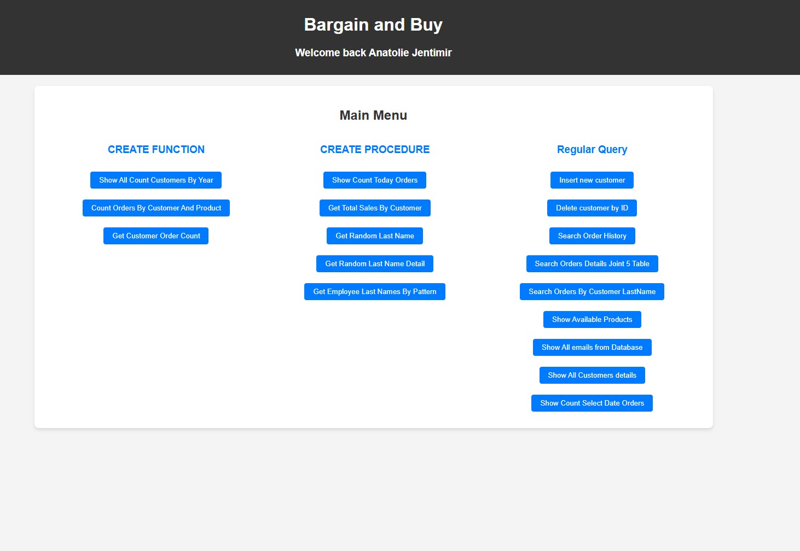
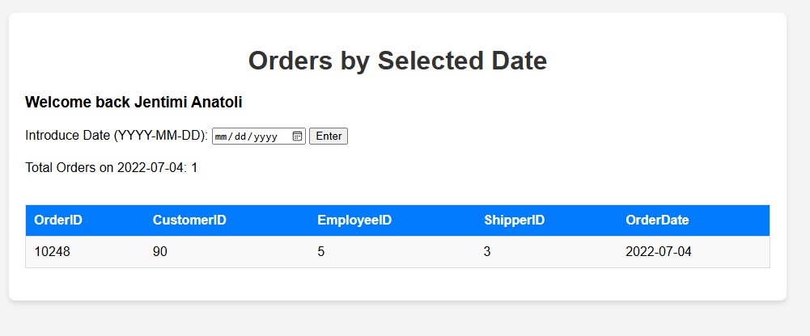
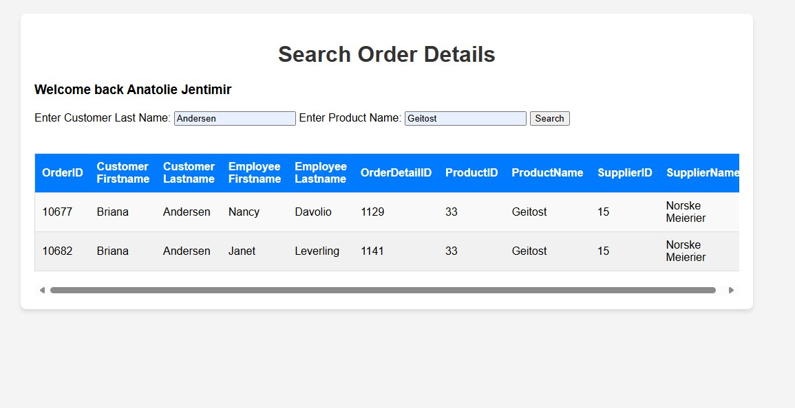

# Bargain and Buy

## Introduction
Welcome to Bargain and Buy, a project aimed at providing a seamless experience for managing customer orders and product information. The main page greets returning users and offers various functionalities for creating, querying, and managing data.

## Main Features
### Main Menu
- **Welcome Message**: Displays a personalized greeting for logged-in users or a guest message for visitors.

### Create Function
- **Show All Count Customers By Year**: Display the number of customers registered each year.
- **Count Orders By Customer And Product**: Calculate the number of orders by specific customers for particular products.
- **Get Customer Order Count**: Retrieve the total number of orders made by a customer.

### Create Procedure
- **Show Count Today Orders**: Display the number of orders placed today.
- **Get Total Sales By Customer**: Calculate the total sales made by a customer within a specified date range.
- **Get Random Last Name**: Retrieve a random last name from the customer database.
- **Get Random Last Name Detail**: Retrieve detailed information for a randomly selected customer.
- **Get Employee Last Names By Pattern**: Fetch employee last names based on a specified pattern.

### Regular Query
- **Insert New Customer**: Add a new customer to the database.
- **Delete Customer By ID**: Remove a customer from the database using their ID.
- **Search Order History**: Display the order history for a specific customer.
- **Search Orders Details Joint 5 Table**: Fetch detailed order information using five different tables.
- **Search Orders By Customer Last Name**: Find orders based on the customer's last name.
- **Show Available Products**: Display all products currently available.
- **Show All Emails From Database**: List all customer emails.
- **Show All Customer Details**: Retrieve detailed information about all customers.
- **Show Count Select Date Orders**: Display the number of orders placed on a selected date.

## Screenshot

## How to Use
1. **Insert New Customer**: Click the "Insert new customer" button to add a new customer to the database.
2. **Delete Customer By ID**: Click the "Delete customer by ID" button to remove a customer.
3. **Search Order History**: Click the "Search Order History" button to view the order history.
4. **Show Available Products**: Click the "Show Available Products" button to list available products.
5. **Show All Emails From Database**: Click the "Show All emails from Database" button to view all customer emails.
6. **Show All Customer Details**: Click the "Show All Customers details" button to view all customer information.

## Technologies Used
- **HTML**: Structuring the web page.
- **PHP**: Server-side scripting for handling database operations and session management.
- **MySQL**: Database management to store and retrieve data.

## Getting Started
1. Clone the repository: `git clone https://github.com/your-username/Bargain-and-Buy.git`
2. Navigate to the project directory: `cd Bargain-and-Buy`
3. Set up your web server and database.
4. Import the database schema and data.
5. Run the project on your local server.

## Contributing
Feel free to fork this repository and contribute by submitting a pull request. Let's build something great together!

## License
This project is licensed under the MIT License - see the [LICENSE](LICENSE) file for details.
